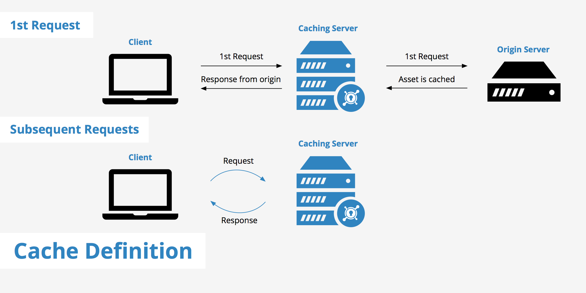
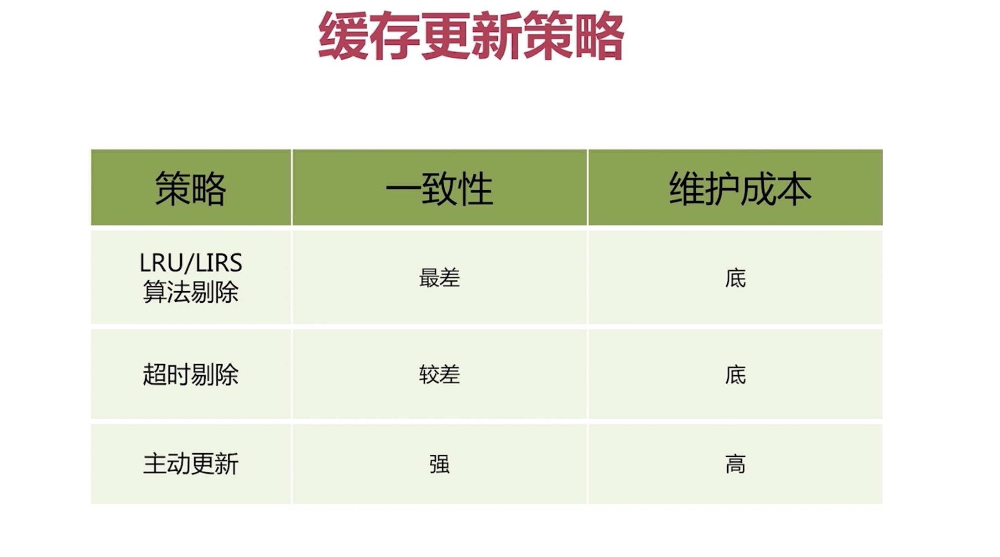
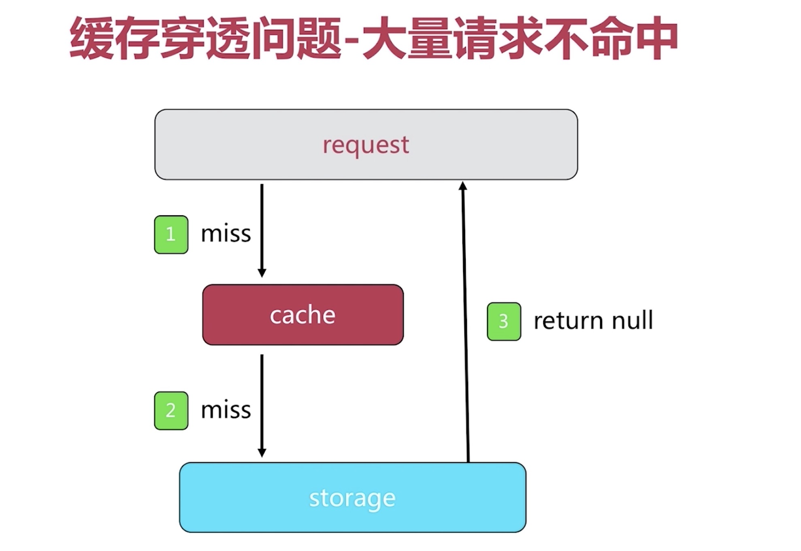
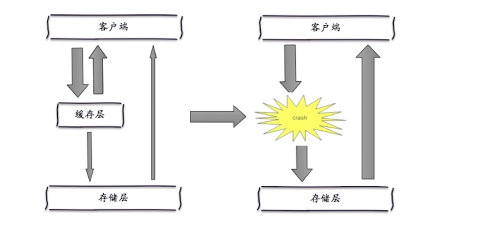

# 缓存的设计与优化

通过前面课程的学习，我们应该能够搭建出一个高可用的缓存层出来。现在让我们从根本上来思考：缓存的意义和价值？如何设计并优化才能使得缓存发挥最大的价值？如何避免缓存中常见的设计缺陷？这就是我们今天需要学习的东西。

## 缓存的收益与成本

相比磁盘的读写速度而言，内存的读写速度要高出几个量级，而大部分缓存都是基于内存实现的。所以要使用缓存的第一个目的就是提高数据的读写速率，进而提高应用程序的响应速度。

另一方面，由于缓存具有高并发和极高的响应速度，可以降低大量请求对数据库或者第三方服务的负载，起到缓冲和保护的作用。

所以，从根本上来说，缓存的收益就两点：提升读写速率和降低后端负载。

当然，一旦使用了缓存，就意味着缓存数据和原数据之间必然有差距，我们需要根据业务的需求来制定合适的更新策略，同时，相比直接请求数据源，缓存层的出现也让代码的维护变的复杂了起来，这些情况一定程度上都增加了运维成本。

## 缓存的更新策略

当然，为了使得缓存数据和原数据之间的差距尽可能的小，我们需要使用恰当的更新策略，需要特别注意的是，这些更新策略的出发点都是从业务角度出发，满足业务需求的更新策略才是最好的更新策略。

常见的更新策略有以下几种：
* LRU/LIRS/FIFO算法剔除
* 超时剔除
* 通过业务主动控制更新

现实开发中，其实也没有一成不变的策略，有时候，我们需要将多个策略结合起来使用，比如超时剔除和主动更新结合，最大内存和淘汰策略兜底。

## 缓存的穿透问题

有时候，某些时候，由于业务涉及原因或者是恶意攻击(如爬虫等)，前端大量的请求都无法命中缓存，从而直接请求原数据，造成缓存层形同虚设。如下图所示：

这种情况下，一种通常的解决方法是，将无效的请求的值(如null)也缓存起来，这样会减少对原数据的请求压力。这种方式也会有一些问题：比如需要更多的键，缓冲层和存储层数据短期不一致。这些问题可以使用过期时间，强制刷新等方式来解决。还有一种方式是使用`Bloom Filter`来拦截请求，这种方式我们后面来介绍。

## 缓存雪崩优化

使用缓存的原因之一是降低对原数据的请求负载，但是某些特殊情况下，承载了大量请求的缓存服务突然宕机，流量直接压向原数据服务(如DB), 要么瞬间击垮服务，要么极大的降低了应用程序性能，进一步造成级联故障。

这种情况下，一般没有通用的解决方案，但是可以从以下思路入手：
* 保证缓存高可用，这样缓存层宕机的概率会大大降低
* 依赖隔离组件为后端限流，降级处理等。
* 提前演练，暴露问题，解决问题。

